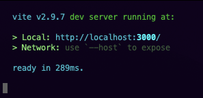
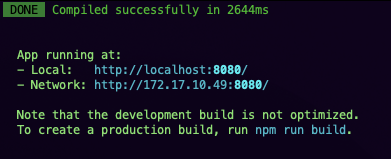
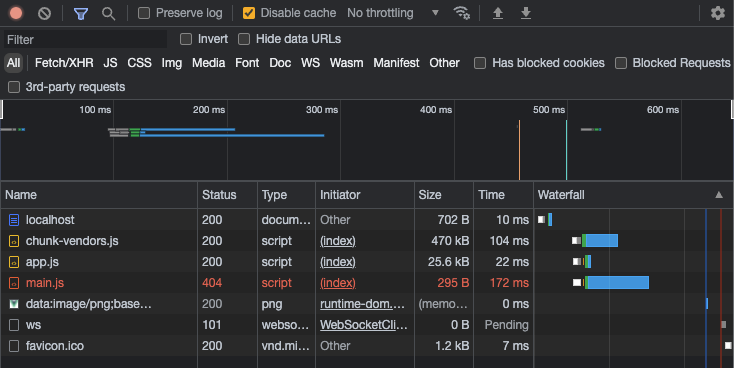
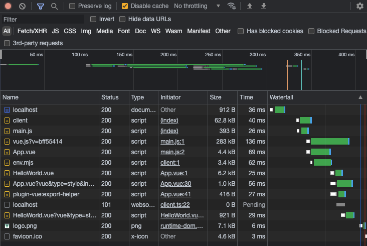

# Vite Usage

`@vue/cli 5.0.4` was used to create a standard client-side Vue application. There were minimal changes to move the initial components to more closely mimic the Vite example (`script setup` syntax) in addition to adding `"vue/setup-compiler-macros": true` to the eslint `env` object.

# Local Development

## Vue/Webpack (Via Vue CLI)

- Run `npm ci`
- Run `npm run vue-cli:serve`
- Go to `http://localhost:8080/`

## Vue/Vite

- Run `npm ci`
- Run `npm run vue-cli:serve`
- Go to `http://localhost:3000/`

# Comparison

It's important to know the differences between modules patterns in JS as Webpack and Vite do not offer the same support. I found this [module comparison article](https://blog.sessionstack.com/how-javascript-works-the-module-pattern-comparing-commonjs-amd-umd-and-es6-modules-437f77548437) useful in breaking things down in an easy to digest manner.

* CommonJS/CJS (Export modules with `module.exports` and import via `require()`)
    * _Note: Used in Node_
* Asynchonous Module Definition/AMD (Single function called `define()`)
    * _Note: Requires a loader such as [RequireJS](https://requirejs.org/)_
* ES Modules (Export modules with `export {}` and import via `import * from foo`)
## Primary Differences
### Webpack

* Supported Modules:
    * ES Modules, CommonJS and AMD Modules
* Dev Server:
    * Bundled modules served via [webpack-dev-server](https://webpack.js.org/configuration/dev-server/) using an [Express.js](https://expressjs.com/) web server
* Production Build:
    * [webpack](https://webpack.js.org/)

At a very basic level, when running a build webpack will:
* Starting with an entry file
* Build a tree of the dependencies (imports/exports/requires)
* Transform/Compile modules (code transpilation, etc)
* Sorts, rewrites and concatenates code based on rules (loaders)
* Optimize the output
* (optional/dev) Start webpack-dev -erver
* (optional/dev) Setup sockets for HMR

When a request is made to the app, it loads the generated files. The end result is that the bigger the app gets, the slower everything goes. Webpack does not scale very well because if a file changes, HMR has to regenerate the _entire_ file.

| Initial Request                                           | File Changed                                                  |
|-----------------------------------------------------------|---------------------------------------------------------------|
|  |  |

### Vite

* Supported Modules:
    * ES Modules
* Dev Server:
    * Native ES Modules, served via Vite using a [Koa](https://koajs.com/) web server
* Production build:
    * [Rollup](https://rollupjs.org/guide/en/)

At a very basic level, when running a build vite will:
* On first run, optimizes `node_modules`
* Starts the Koa dev server (no bundle or complication requirements)
* Assumes that a modern browser is being used (no babel transpilation)

When a request is made to the app, the browser knows how to parse the native ES module code and will read the imports/exports to generate the requests. Vite scales well because if a file changes, it will only request the changed modules for the route you're on and any other unchanged modules will return a 304 unmodified status code.

| Initial Request                                     | File Changed                                            |
|-----------------------------------------------------|---------------------------------------------------------|
|  |  |

## Performance

Over the course of 5 local builds:

| Tool    | Run 1  | Run 2  | Run 3  | Run 4  | Run 5  | Average | Diff     |
|---------|--------|--------|--------|--------|--------|---------|----------|
| Webpack | 4311ms | 2486ms | 2266ms | 2268ms | 1968ms | 2659.8  | 0        |
| Vite    | 471ms  | 271ms  | 257ms  | 237ms  | 271ms  | 301.4   | +782.48% |

Using Webpack as our baseline, Vite blows it out of the water when it comes to build speed. On average, Vite is `782.48%` faster than Webpack.
# Technology

- [Vue CLI](https://cli.vuejs.org/)
- [Vite](https://vitejs.dev/)

# References

- [Vite Documention: Slow Server Start](https://vitejs.dev/guide/why.html#slow-server-start)
- [How Does Vite Work](https://harlanzw.com/blog/how-the-heck-does-vite-work/)
- [Next Generation Frontend Tooling With ViteJS](https://www.youtube.com/watch?v=UJypSr8IhKY)
